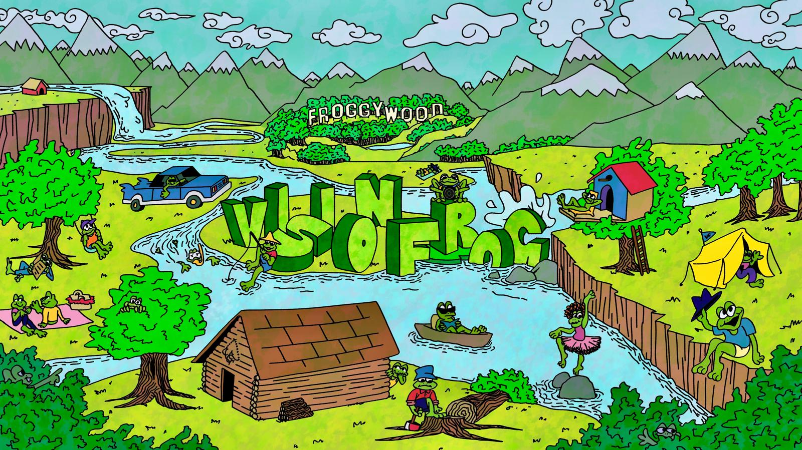

# The Vision Frog



**The Vision Frog** is the official portfolio and production website for Oliver Stemmler, a filmmaker and student at NYU Tisch School of the Arts. The site showcases a diverse body of work including music videos, narrative films, commercials, and portraits, while also serving as a hub for merchandise and contact.

## 🟢 Live Demo
[https://thevisionfrog.com/](https://thevisionfrog.com/)

---

## 🚀 Features

* **Responsive Portfolio Grid:** Dynamic tile layout that showcases four main categories (Music Videos, Narrative, Commercials, Portraits).
* **Custom Design System:** High-contrast "Dark Mode" aesthetic using neon green accents (`#3dff02`) and custom typography.
* **Optimized Performance:** Uses modern image formats (WebP/Optimized JPG) and lazy loading for fast performance.
* **Merch Store Interface:** A catalog layout for browsing available merchandise with direct calls-to-action (Instagram DM).
* **Global Navigation:** Sticky navigation bar that auto-hides on scroll-down and reveals on scroll-up for maximum screen real estate.

---

## 🛠️ Tech Stack

* **Core:** HTML5, CSS3, Vanilla JavaScript
* **Styling:** CSS Variables, Flexbox, CSS Grid
* **Fonts:** Apfel Grotezk, Neue Haas Grotesk (Self-hosted)


---

## 📂 Project Structure

This project follows a clean, asset-based directory structure:

```text
VisionFrog/
├── assets/
│   ├── css/
│   │   ├── global.css       # Main styles & variables
│   │   └── fonts.css        # Font face definitions
│   ├── fonts/
│   │   ├── ApfelGrotezk/    # Primary body font
│   │   └── NHG/             # Header/Display font
│   ├── images/
│   │   ├── banners/
│   │   ├── icons/
│   │   ├── music-videos/
│   │   ├── merch/
│   │   └── about/
│   └── js/
│       └── main.js          # (Optional) External JS scripts
├── index.html               # Landing Page
├── About.html               # Bio & Brand Collage
├── Merch.html               # Merchandise Catalog
├── MusicVideos.html         # Portfolio Sub-pages
└── ...